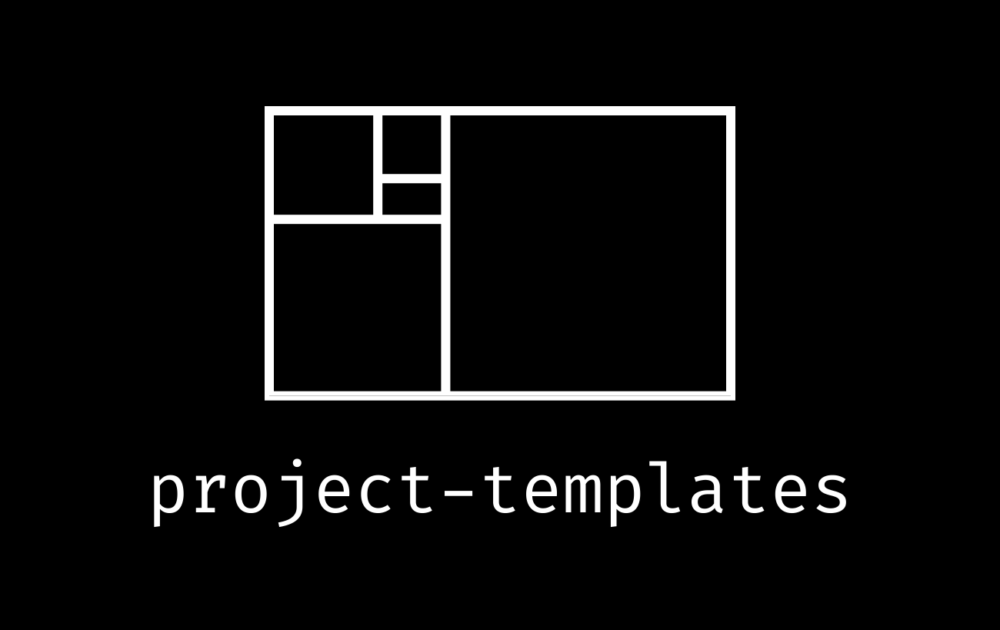

<a name="readme-top"></a>

<br/>

<div align="center">

<p>
  
</p>

<p>
 Welcome to phi school's <code>project-templates</code> repository. <br> Here, you'll find standardized templates to aid rapid and consistent development, ensuring <br> alignment with phi school's best practices.
</p>

[Contribute!](#contributing--development) | [Request a Feature][github-issues-link] | [Report a Bug][github-issues-link]

</div>

<br/>

## Table of Contents

- [Project Goals](#project-goals)
- [Included Templates](#included-templates)
- [Getting Started](#getting-started)
  - [Prerequisites](#prerequisites)
  - [General Installation](#general-installation)
- [Contributing & Development](#contributing--development)
- [License](#license)

## Project Goals

The `project-templates` repository is dedicated to maintaining a curated collection of templates. These are designed to seamlessly integrate high-quality tools, empowering developers to swiftly tackle complex problems with well-implemented, scalable solutions.

Our approach to template design is rooted in continuous experimentation and direct developer feedback. Through this, we identify ideal tool combinations, patterns, and practices that support cohesive collaboration and yield superior results.

We remain independent from any specific vendors, frameworks, languages, and paradigms. Our goal is to objectively evaluate technologies and understand their trade-offs. We prioritize open-source, platform-neutral solutions that offer both developers and users the greatest degree of autonomy while accommodating diverse infrastructures.

As technology progresses, we will continually re-evaluate our toolset. Our commitment is to always incorporate tools that provide the best in performance, developer experience, and stability.

<div align="right">
  
[![][back-to-top]](#readme-top)

</div>

## Included Templates

The following table provides an overview of the templates currently included in the repository:

| Template Name                             | Description                                                                                                                                             | Features                                                                                                  |
| ----------------------------------------- | ------------------------------------------------------------------------------------------------------------------------------------------------------- | --------------------------------------------------------------------------------------------------------- |
| [`node-ts-monorepo`](./node-ts-monorepo/) | A setup for a Node.js TypeScript monorepo in a reproducible, isolated dev environment. Ideal for managing multiple packages within a single repository. | Devbox, Turborepo, pnpm workspaces, Changesets, GitHub Actions, tsup, Vitest, ESLint, Prettier, and more. |
| [`node-ts-package`]()                     | A single-package repository or "polyrepo" optimized for streamlined development and distribution.                                                       | Devbox, pnpm, semantic-release, GitHub Actions, tsup, Vitest, ESLint, Prettier, and more.                 |
| [`readme`]()                              | A standardized template for creating README files. Ensures consistent documentation across phi school projects.                                         |                                                                                                           |

## Getting Started

> **Note**\
> For specific installation and usage instructions, refer to each respective template's `README.md`.

### Prerequisites

#### degit

Templates can be most efficiently installed using [degit](https://github.com/Rich-Harris/degit), which you can install globally with your preferred package manager:

```bash
pnpm install -g degit
# OR
npm install -g degit
# OR
yarn global add degit
# OR
nix-env -iA nixpkgs.nodePackages.degit
```

#### Devbox

Additionally, many templates make use of [Devbox](https://www.jetpack.io/devbox/docs/) to create a reproducible, isolated dev environment. Devbox is based on the superior [Nix Package Manager](https://nixos.org/download.html). See [Installing Devbox](https://www.jetpack.io/devbox/docs/installing_devbox/) to quickly get started.

### General Installation

With `degit` installed, run the following command, replacing `<TEMPLATE_NAME>` with the name of the desired template, and `<YOUR_PROJECT_NAME>` with your desired project name:

```bash
degit phi-school/templates/<TEMPLATE_NAME> <YOUR_PROJECT_NAME>
cd <YOUR_PROJECT_NAME>
```

<div align="right">
  
[![][back-to-top]](#readme-top)

</div>

## Contributing & Development

Feedback and contributions are encouraged! If you know of a superior technology or implementation that is not included in our templates, please initiate a [discussion](https://github.com/phi-school/project-templates/discussions) and make a case for it. As the technological landscape is vast and continually evolving, we remain open-minded and constantly question our own assumptions.

Please see the [Contributing Guide][contributing-guide] for more information.

[![][contributors-contrib]][contributors-link]

<div align="right">
  
[![][back-to-top]](#readme-top)

</div>

## License

This project is released under the [MIT](./LICENSE) License. © 2023-Present [phi school](https://phi.school)

<div align="right">
  
[![][back-to-top]](#readme-top)

</div>

<!-- Link Group -->

[back-to-top]: https://img.shields.io/badge/-⇧_Back_To_Top-black?style=flat-square
[changelog-link]: ./CHAGNELOG.md
[contributing-guide]: ./CONTRIBUTING.md
[contributors-contrib]: https://contrib.rocks/image?repo=phi-school/project-templates
[contributors-link]: https://github.com/phi-school/project-templates/graphs/contributors
[github-issues-link]: https://github.com/phi-school/project-templates/issues
